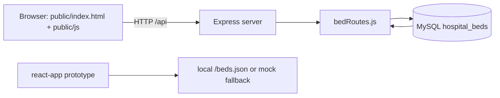

# Hospital Bed Dashboard

Hospital Bed Dashboard is a small full-stack bed-occupancy application. Its primary implementation is a browser dashboard under `public/` backed by an Express/MySQL API under `server/`. A separate `react-app/` directory contains a Vite/React dashboard prototype that currently reads local/mock data rather than the MySQL API.

## What the main application supports

- View beds ordered by ward and bed number.
- Filter the dashboard by ward and status.
- Inspect patient and doctor details for occupied beds.
- Admit a patient to an available bed.
- Discharge an occupied bed.
- Transfer a patient to another available bed in a transaction.
- Persist bed, patient, and doctor records in MySQL.

## Architecture



The static dashboard is the implementation wired to the backend. The React prototype is useful for UI exploration but is not an API client for the Express server yet.

## Stack

| Layer | Technologies |
| --- | --- |
| Frontend | HTML, CSS, browser JavaScript; optional React 18/Vite prototype |
| Backend | Node.js, Express 4, CORS, dotenv |
| Database | MySQL via `mysql2/promise` |
| Development | npm, nodemon |

## Run the main application

Prerequisites: Node.js 18+, npm, and a running MySQL server.

1. Create the database schema from the repository root:

   ```bash
   mysql -u <mysql-user> -p < server/db/schema.sql
   ```

2. Configure the backend:

   ```bash
   cd server
   npm install
   Copy-Item .env.example .env       # PowerShell
   # or: cp .env.example .env
   npm start
   ```

3. In another terminal, serve the static frontend from the repository root:

   ```bash
   python -m http.server 5500 --directory public
   ```

4. Open `http://localhost:5500`. The browser JavaScript calls the API at `http://localhost:5000/api`.

The server defaults to port `5000`. Environment variables are documented in [`server/.env.example`](server/.env.example). Never commit `server/.env` or real database credentials.

## API

| Method | Endpoint | Purpose |
| --- | --- | --- |
| `GET` | `/api/health` | Confirm the Express server is running |
| `GET` | `/api/beds` | List beds with patient and doctor information |
| `GET` | `/api/beds/:bedId` | Read one bed |
| `POST` | `/api/beds/:bedId/admit` | Admit a patient to an available bed |
| `POST` | `/api/beds/:bedId/discharge` | Release an occupied bed |
| `POST` | `/api/beds/:bedId/transfer` | Transfer a patient using a MySQL transaction |

Example admit body:

```json
{
  "patientName": "Example Patient",
  "patientId": "patient-001",
  "doctor": "Example Doctor",
  "admissionReason": "Observation"
}
```

## React prototype

```bash
cd react-app
npm install
npm run dev
```

The prototype searches by bed ID, ward, or patient, filters by status, and renders loading/empty states. Its `src/services/api.js` attempts `/beds.json` and falls back to a small in-memory fixture; connect it to the Express routes before treating it as the production UI.

## Project structure

```text
public/                 primary static dashboard and API client
server/
  server.js             Express bootstrap and health route
  routes/bedRoutes.js   bed, admission, discharge, and transfer routes
  db/schema.sql         MySQL schema and seed rows
  db/connection.js      MySQL connection pool
react-app/              separate React/Vite prototype
documents/              project abstract
```

## Verification

```bash
cd server
node --check server.js
node --check routes/bedRoutes.js

cd ../react-app
npm run build
```

Database-backed flows require a running MySQL instance, so they are not claimed as verified by a static syntax check alone.

## Author

**Karkala Shiva Reddy** — [GitHub](https://github.com/karkalashivareddy)
